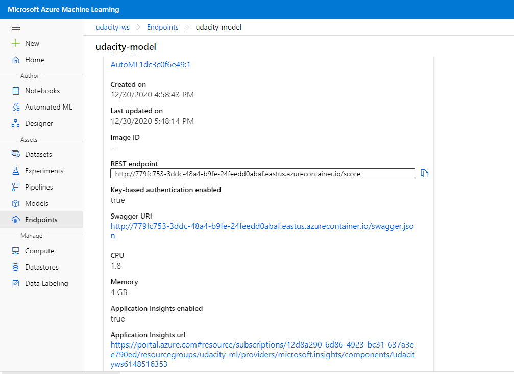

# Project: Operationalizing Machine Learning

This project is part of the Udacity Azure ML Nanodegree. The aim of this project is to configure a cloud-based machine learning production model using Azure AutoML, deploy it, and consume it via an HTTP endpoint. Once this was done a machine learning pipeline was created using Azure AutoML, published and then consumed, again via an HTTP endpoint.

The [Bank Marketing dataset](https://automlsamplenotebookdata.blob.core.windows.net/automl-sample-notebook-data/bankmarketing_train.csv) was used. The dataset contains data about direct marketing campaigns of a banking institution. We seek to predict if a banking client will subscribe to a term deposit (variable y).

## Architectural Diagram

An architectural overview of the key steps in the project can be seen below.

## Key Steps

### Step 1 - Authentication

In this step I create a Service Principal user role with controlled permissions to access specific resources. Using a service principal reduces the scope of permissions available to the user and enhances security.

Firstly, I installed Azure CLI on my local machine so that I could interact with Azure. I logged in and then installed the Azure ML extension.

$ az extension add -n azure-cli-ml

Then I created a Service Principal account ("ml-auth") as shown in the following screenshot.

The Service Principal was then granted "owner" access to my ML workspace.

### Step 2 - Automated ML Experiment

In this step I create an experiment using AutoML, configured a compute cluster and then used that cluster to run the experiment.

The Bank Marketing dataset was registered in the workspace.

The AutoML experiment was set up to classify if a banking client will subscribe to a term deposit. The experiment completed and the best model was a Voting Ensemble with 91.866% accuracy.

The best model can be seen here at the top of the list of models.

The top 4 features that influence the model can be seen below as per the model explanation feature.

### Step 3 - Deploy the Best Model

The model was then deployed from the Azure Portal using the Azure Container Instance.

### Step 4 - Enable Logging

In this step I enabled Application Insights and then retrieved the logs. Firstly, I created a Python virtual environment, activated it and then installed the Azure Python SDK.

$ pip install azureml-sdk

Within the virtual environment I then executed the logs.py file to enable Application Insights and retrieve the logs. I added the following line of code to the logs.py file.

$ service.update(enable_app_insights=True)

Below you can see Application Insight is enabled in the Azure Portal.

The resulting log output can be seen below.

### Step 5 - Swagger Documentation

In this step an instance of Swagger was deployed to display the API documentation for the best model.

The swagger.json file was downloaded from the Azure Portal for the best model endpoint. The script "swagger.sh" was ran and downloaded the latest swagger container to be run on port 9000. "Serve.py" was ran to enable a Python webserver on port 8000.

The Swagger service was accessed via a browser on port 9000. The API documentation was examined by copying http://localhost:8000/swagger.json into the Explorer field towards the top of the browser screen. The API details from Swagger can be seen below.

### Step 6 - Consume Model Endpoint

In this step the "endpoint.py" script was executed so as to interact with the best model endpoint. The "scoring_uri" and "key" parameters were updated using the endpoint information found in the Azure Portal. Two sets of features were passed to the best model endpoint using the script. The resulting output can be seen below.

### Step 7 - Create, Publish and Consume Pipeline

In this step the provided Jupyter Notebook was uploaded to the workspace. The notebook uses the Azure Python SDK to interact with the workspace. Relevant parameters in the notebook were updated. The cells in the notebook were ran. The notebook can be broadly split into 3 sections:

#### 1 Create and Submit a Pipeline

1. Identify the existing experiment from step 2.
2. Identify a compute instance.
3. Load the registered dataset.
4. Create a pipleline and an AutoML step.
5. Run the pipeline.

#### 2 Examine Model Results

1. Retrieve metrics from child runs.
2. Retrieve best model.
3. Test model.

#### 3 Publish Pipeline and run REST endpoint 

1. Publish pipeline.
2. Retrieve authentication header.
3. Trigger pipeline to run using the REST endpoint.

The pipeline created using the Azure Python SDK can be seen below.

The pipeline was then published as an endpoint.

The dataset and AutoML module can been seen within the pipeline overview.

The published pipeline overview is as follows.

The RunDetails widget from the notebook can bee seen below.

The pipeline triggered by the REST endpoint can be seen in the below list.

The pipeline overview for the triggered pipeline is below.

### Step 8 - Documentation

For this project the key documentation was this README.md file and a screen recording (detailed below).

## Screen Recording

The project screencast can be found here: https://youtu.be/zW52CsUDfhk

## Improvements

* Automate the testing and deployment of the best model found by the AutoML pipeline.

* Notebook seems to be using the training data to test the model. This is not a fair test as the model has already seen the training data. It should use an unseen set of test data.

